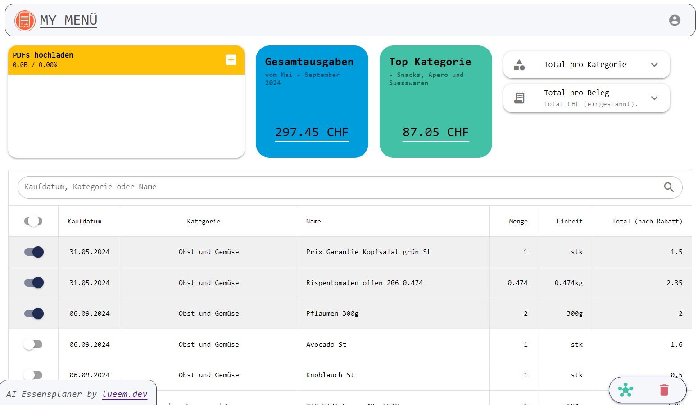

# 🛸 My Menü - AI Essensplaner

## Showcase App

<https://mymenu-bdf37.firebaseapp.com/>

## Funktionen

1. Einkaufsbeleg-Scannen: Registrierte Benutzer können ihren Coop oder Migros Einkaufsbeleg über ihr Desktop, Tablet oder Mobilgerät einscannen. Die Applikation unterstützt die Einlesung von Einkaufsbelegen als PDF-Datei. Deine Belege kannst du von Supercard oder deinem Migros-Cumulus-Konto herunterladen.

2. Textextraktion: Nach dem Einlesen wird der Beleg an das Backend gesendet, das für die Textextraktion und -aufbereitung zuständig ist. Diese Konversionsschicht stellt sicher, dass die Daten sparsam und in einem für die weitere Verarbeitung geeigneten Format vorliegen.

3. Datenverarbeitung mit ChatGPT: Die aufbereiteten Daten werden an ChatGPT übermittelt, wo sie strukturiert und in ein JSON-Format umgewandelt werden. Dies ermöglicht eine präzise und nutzerfreundliche Darstellung der Einkaufsdaten.

4. UI: In der Applikation können Nutzer die eingelesenen Daten einsehen und bei Bedarf bearbeiten. Dieser Schritt ist wichtig, um die Relevanz der Menüvorschläge zu gewährleisten.

5. Analyse: Die App bietet Analyse- und Filterfunktionen deiner Essensartikel. Alle Artikel können kategorisiert und ihre Einheiten extrahiert werden. Damit hast du deine Ausgaben über Monate hinweg im Überblick und kannst deine Einkäufe nach ihrer Kategorie auswerten.
