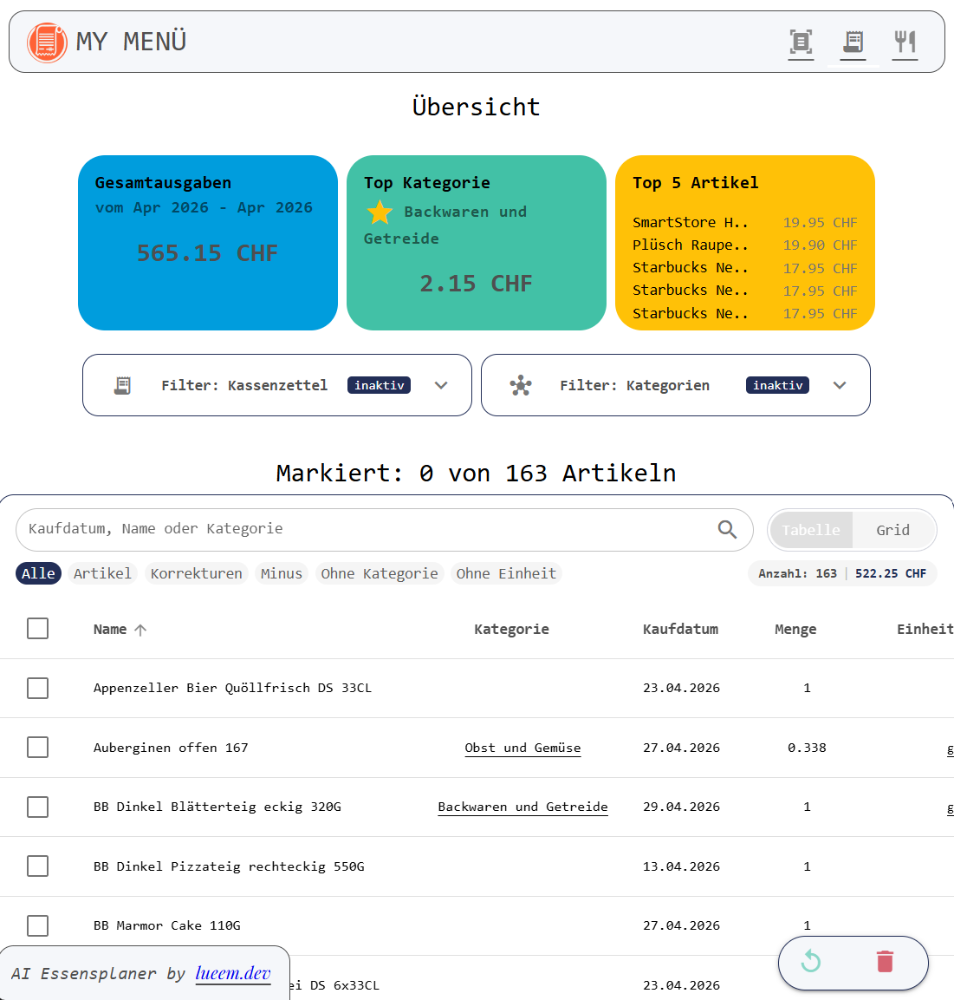

# My Menü - AI Essensplaner



## Showcase App

<https://nile4000.github.io/mymenu/#/>

## Überblick

My Menü ist eine Web-App zum Erfassen, Strukturieren und Auswerten von Einkaufsbelegen. Die App liest PDF-Belege ein, extrahiert daraus Artikel, Preise, Mengen und Belegmetadaten und macht die Daten anschließend in einer übersichtlichen Oberfläche nutzbar.

Der Fokus liegt auf Schweizer Einkaufsbelegen, insbesondere von Coop/Supercard und Migros/Cumulus. Importierte Artikel können gefiltert, korrigiert, kategorisiert und für Rezeptvorschläge verwendet werden.

## Funktionen

- PDF-Belege hochladen und auslesen
- Artikel, Mengen, Preise, Rabatte und Beleginformationen strukturiert erfassen
- Einkaufsartikel nach Kategorien auswerten
- Einheiten wie `g`, `kg`, `ml`, `l` oder `stk` automatisch erkennen
- Kategorien zentral über das Backend bereitstellen
- Rezeptvorschläge aus vorhandenen Artikeln erzeugen
- Ausgaben nach Beleg, Zeitraum und Kategorie analysieren
- Supercard-Belege über eine manuelle Session synchronisieren

## Interne AI-Funktionen

Die App nutzt AI für Texterkennung, Kategorisierung und Verarbeitung der Einkaufsdaten:

- **Beleganalyse:** PDF-Text wird im Backend vorbereitet und per OpenAI in strukturierte JSON-Daten umgewandelt.
- **Kategorisierung:** Artikel werden über einen internen Categorization-AI-Service passenden Einkaufskategorien zugeordnet.
- **Einheitenerkennung:** Aus Artikelnamen und Preisen werden sinnvolle Einheiten extrahiert.
- **Rezeptgenerierung:** Aus vorhandenen Lebensmitteln erstellt die AI deutschsprachige Rezeptvorschläge mit Zutaten, Mengen und Zubereitungsschritten.

## Technischer Aufbau

- **Frontend:** Quasar/Vue-App für Upload, Auswertung, Kategorien, Filter und Rezeptfunktionen
- **Backend:** Kotlin/Quarkus API für PDF-Extraktion, AI-Gateway, Kategorien und Integrationen
- **Datenhaltung:** Supabase/PostgreSQL für Belege und Artikel
- **AI:** OpenAI für Belegextraktion, Einheitenerkennung und Rezeptgenerierung; Embedded-Service für die Artikel-Kategorisierung
- **Integration-Layer:** Supercard-Sync für deine verfügbaren Coop-Belege

## Wichtige Backend-Endpunkte

- `POST /api/extract-pdf` - PDF-Beleg auslesen
- `GET /api/categories` - verfügbare Kategorien abrufen
- `POST /api/ai/categorize` - Artikel kategorisieren
- `POST /api/ai/extract-unit` - Einheiten aus Artikeln extrahieren
- `POST /api/ai/recipe` - Rezept aus Artikeln erstellen
- `GET /api/integrations/supercard/status` - Supercard-Login-Session prüfen
- `GET /api/integrations/supercard/available` - verfügbare Supercard-Belege anzeigen
- `POST /api/integrations/supercard/sync` - Supercard-Belege importieren

## Lokale Entwicklung

Backend:

```shell
cd C:\dev\mymenu\project\backend
quarkus dev
```

Frontend:

```shell
cd C:\dev\mymenu\project\frontend
npm run start
```

