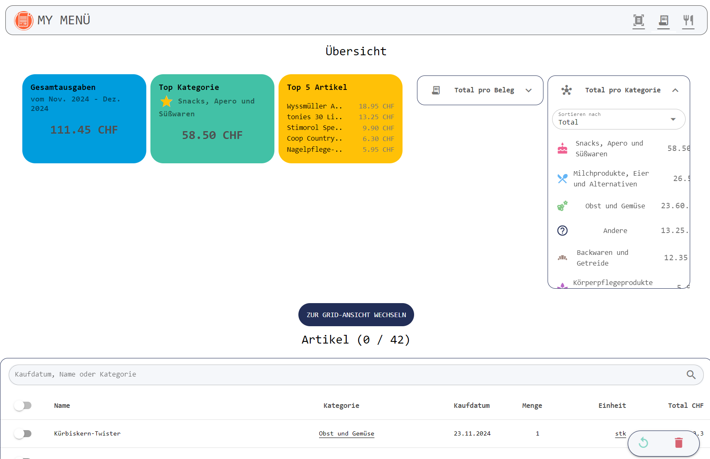

# 🛸 MyMenu - AI Meal planner

## Showcase App

App will be up again soon..

<https://mymenu-bdf37.firebaseapp.com/>

## Funktionen

1. Einkaufsbeleg-Scannen: Registrierte Benutzer können ihren Coop oder Migros Einkaufsbeleg über ihr Mobilgerät einscannen. Die Applikation unterstützt die Einlesung von Belegen als PDF-Datei.

2. Textextraktion: Nach dem Einlesen wird der Beleg an das Backend gesendet, die für die Textextraktion und -aufbereitung zuständig ist. Diese Konversionsschicht stellt sicher, dass die Daten sparsam und in einem für die weitere Verarbeitung geeigneten Format vorliegen.

3. Datenverarbeitung mit chatGPT: Die aufbereiteten Daten werden an ChatGPT übermittelt, wo sie strukturiert und in ein JSON-Format umgewandelt werden. Dies ermöglicht eine präzise und nutzerfreundliche Darstellung der Einkaufsdaten.

4. Frontend-Interaktion: Im Frontend der Applikation können Nutzer die verarbeiteten Daten einsehen und bei Bedarf bearbeiten. Dieser Schritt ist entscheidend, um die Genauigkeit und Relevanz der Menüvorschläge zu gewährleisten.

5. Analyse: Coming soon..
